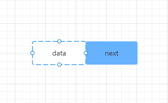

# 在 Vue3 中手写实现 React 式的 Hooks（useState、useEffect）进而深入理解函数组件 Hooks 的本质原理

### 前言

首先本文不会过度深入讲解只属于 React 或者只属于 Vue 的原理，所以只懂 React 或者只懂 Vue 的同学都可以畅通无阻地阅读本文。

关于 Vue3 的 React 式 Hooks 的实现原理和 React Hooks 的实现原理在社区里已经有很多讨论的文章了，希望本文可以给你不一样的角度去理解 React Hooks 的本质原理，也只有理解了 React Hooks 实现的本质原理，才可以在 Vue3 的函数式组件上实现跟 React Hooks 一样的 Hooks 函数，例如： useState、useReducer、useEffect 、useLayoutEffect 等。

关于 Vue3 的 React 式 Hooks，Vue.js 核心团队成员 Anthony Fu 也出了一个 Vue Hooks 工具库 VueUse，但本文不是去探讨 VueUse 的实现原理，而是通过实现一个 Vue3 函数式组件的 Hooks 去了解 React Hooks 的本质原理。本文更多的想探讨 React Hooks 的原理，同时在实现 Vue3  函数式组件的 Hooks 的过程也进一步理解 Vue3 的运行原理和调度原理等。

Vue3 的函数式组件或许很多人了解得不多，因为 Vue 官方也不推荐使用，所以通过本文你不但可以了解 React Hooks 的原理，也希望给 Vue 阵营的同学也可以提供一下关于 Vue3 函数式组件的知识。

### 在 Vue3 函数式组件中的 React-style Hooks

我们先来看一段代码

```javascript
import { useState, useReducer, useEffect, useLayoutEffect } from "vue-hooks-api";

const FunctionalComponent = (props, context) => {
  const [count1, setCount1] = useState(0);
  const [count2, setCount2] = useReducer((x) => x + 1, 1);
  const [count3, setCount3] = useReducer((x) => x + 1, 2);

  useEffect(() => {
    console.log("useEffect", count2);
  }, [count2]);

  useLayoutEffect(() => {
    console.log("useLayoutEffect", count2);
  }, [count2]);

  return (
    <>
      <button onClick={() => setCount1(2)} {...props}>
        count1:{count1}
      </button>
      <button onClick={() => setCount2()} {...props}>
        count2:{count2}
      </button>
      <button onClick={() => setCount3()} {...props}>
        count3:{count3}
      </button>
    </>
  );
};

export default FunctionalComponent;
```

React 的同学可能以为这是一个 React 的函数组件，其实不是，这是一个 Vue3 的函数式组件，通过 `vue-hooks-api` 包提供的 `useState`, `useReducer`, `useEffect`, `useLayoutEffect` Hooks 函数，就可以在 Vue3 的函数式组件中使用了，再通过 JSX 方式使用则看起来基本可以跟 React Hooks 一样了。

**关于 vue-hooks-api npm 包**

`vue-hooks-api` npm 包是本文作者发布的一个 React 风格的 Vue3 Hooks 包，目前只可使用于 Vue3 函数式组件，跟 React 的函数式组件的 Hooks 使用方式一致。

可以通过 yarn 方式安装体验。

```
yarn add vue-hooks-api
```

注意，此 npm 包目前只是一个实验性产品，旨在探讨如何在 Vue3 的函数组件中实现 React 式的函数组件 Hooks，请慎用于生产环境。

下文也将围绕这个 `vue-hooks-api` npm 包如何实现的进行讲解。

### Hooks 是什么

首先 Hooks 不是 React 特有，比如我们使用的 Git 工具，也有 Git Hooks，在把代码 push 到远程仓库之前，可以设置 Git Hooks 插件进行代码检查、代码测试，通过了 Git Hooks 的处理之后才可以把代码 push 到远程仓库。

有 Hooks 的程序就像高速公路上的收费站，如果某个地方设置了收费站，那么你必须要经过收费站的处理，你才可以继续通行。

没有 Hooks 的程序就像国道，你可以一路畅通无阻地通行。

  

Hooks 的英文翻译是 “钩子”，Vue、React 的那些生命周期函数，也被称为钩子函数，所以 Vue、React 生命周期函数也是 Hooks 函数。

继续上面高速公路收费站的例子，那么收费站就相当于这条高速公路的一个个钩子，把这条高速公路的某个点勾住了，那么就可以在这个地点进行很多事情的处理了，比如说检查车辆，那么你可以设置只检查大货车或者小汽车，又或者节假日什么事情都不做，让所有车辆免费通行。

那么又回到 Vue、React 上面来，Vue、React 提供了很多生命周期的 Hooks，你可以在这些 Hooks 上进行各种设置，比如 Vue3 的 setup 方法就是 Vue2 的生命周期函数 beforeCreate 和 Created 两个钩子函数的代替。

了解一些前置知识之后，我们开始进入我们本文的核心 React Hooks 的理解。

### React Hooks 的本质

首先 React Hooks 只可以使用在 React 的函数组件上，在 React Hooks 出现之前它是不可以存储属于自己的数据状态的，因故也不可以进行数据逻辑的复用。直到 React Hooks 的出现，在 React 的函数组件上就可以进行存储属于它自己的数据状态了，进而可以达到数据逻辑的复用。这也是 React Hooks 的作用，可以进行数据逻辑的复用。

那么为什么 React 可以做到在函数组件上进行存储数据状态的呢？首先 **React 函数组件的本质是一个函数**，React   函数的更新就是重新执行 React 函数组件得到新的虚拟 DOM 数据。那么要在 React 函数组件上存储属于这个函数组件自己的数据，本质就是在一个函数上存储属于这个函数的数据，在这个函数的后续执行的时候还可以获取到它自己内部的变量数据，并且不会和其他函数组件的内部的变量数据发生冲突，**这其中最好的实现方式就是实现一个闭包函数**。

**React Hooks 的最简模型**

```javascript
// Hooks
function useReducer(reducer, initalState) {
    let hook = initalState
    const dispatch = (action) => {
        hook = reducer(hook, action)
        // 关键，执行 setCount 函数的时候会重新执行 FunctionComponent 函数
        FunctionComponent()
    }
    return [hook, dispatch]
}
// 函数组件
function FunctionComponent() {
   const [count, setCount] = useReducer(x => x + 1, 0)
    
   return {count, setCount}
}

const result = FunctionComponent()
// 执行 setCount 会从新执行 FunctionComponent
result.setCount()
```

通过上面 React Hooks 的最简模型可以知道执行组件函数 FunctionComponent 可以看成从 Hooks 返回了两个变量 count 和 setCount，count 很明显是拿来展示使用的，setCount 则是拿来给用户交互使用的，当用户执行 setCount 的时候 FunctionComponent 会重新执行。

上述 React Hooks 的最简模型还存在一个问题，当用户执行 setCount 的时候 FunctionComponent 重新执行的时候，hook 会被一直初始化，值不能进行迭代。那么我们知道 React 当中一个函数组件就是一个 Fiber 节点，所以可以把 hook 存储在 Fiber 节点上。

```javascript
// Fiber 节点
const Fiber = {
    type: FunctionComponent, // Fiber 节点上的 type 属性是组件函数
    memorizedState: null // Fiber 节点上的 memorizedState 属性是 Hooks
}
// Hooks
function useReducer(reducer, initalState) {
    // 初始化的时候，如果 Fiber 节点的 Hooks 不存在则进行设置
    if(!Fiber.memorizedState) Fiber.memorizedState = initalState
    const dispatch = (action) => {
        Fiber.memorizedState = reducer(Fiber.memorizedState, action)
        // 关键，执行 setCount 函数的时候会重新执行 FunctionComponent 函数
        Fiber.type()
    }
    return [Fiber.memorizedState, dispatch]
}
// 函数组件
function FunctionComponent() {
    const [count, setCount] = useReducer(x => x + 1, 0)
    console.log("渲染的count:", count) 
    return {count, setCount}
}

const result = Fiber.type() // 打印 0
// 执行 setCount 会从新执行 FunctionComponent
result.setCount() // 打印 1
result.setCount() // 打印 2
result.setCount() // 打印 3
```

经过上述代码修改之后，一个最简单的 React Hooks 的模型就实现完成了，这也是 React Hooks 的本质。值得注意的是其中 reducer 的实现跟 Redux 的 reducer 的实现是很相似的，这是因为它们是同一个作者开发的功能的缘故。

### React Hooks 的链表

在上面的代码中，我们只在函数组件里使用了一个 Hooks，但实际开发中，我们是会同时使用多个 Hooks 的。例如：

```javascript
// 函数组件
function FunctionComponent() {
    const [count1, setCount1] = useReducer(x => x + 1, 0)
    const [count2, setCount2] = useReducer(x => x + 1, 0)
    console.log("渲染的count1:", count1) 
    console.log("渲染的count2:", count2)
    return {count1, setCount1, count2, setCount2}
}
```

那么在使用多个 Hooks 的时候，我们又怎么去存储这些 Hooks 呢？我们知道在 React Hooks 中是把所有的 Hooks 设置成了一个链表结构的数据，那么其中的原理又是怎么样的呢？

链表的基本思维是，利用结构体的设置，额外开辟出一份内存空间去作指针，它总是指向下一个节点，一个个节点通过 Next 指针相互串联，就形成了链表。

 

其中 Data 为自定义的数据类型，Next 为指向下一个链表结点的指针，通过访问 Next，就可以访问链表的下一个节点了。 

链表的结构有很多种，React 中的链接结构属于：**不带头单向非循环结构** 。我们可以把这种链表理解成为一个火车，每个链表，其实就是一节车厢，数据存储在车厢中中，而每个火车节都有一个指针，连接着下一个火车节 。

 

那么在 React 使用代码怎么来实现这个链表数据结构呢？

我们通过上文知道 Hook 存储在 Fiber 节点的 memorizedState 属性上的，Hook 的数据结构也可以通过上文得知可以这样设置：

```javascript
const hook = {
      memorizedState: null, // 存储 hook 
      next: null,  // next 指针，指向下一个 hook
}
```

我们可以设置一个中间变量 workInProgressHook 来存储当前的尾 hook 是哪一个，当有新的 hook 进来的时候，可以通过当前的尾 hook 的 next 指针指向它，那么这个新的 hook 成了新的尾 hook，所以 workInProgressHook 中间变量需要更新成新的 hook。当再有新的 hook 进来的时候，则可以通过 workInProgressHook 是否有值进行判断是不是头节点的 hook，如果 workInProgressHook 有值则把新的 hook 存储在 workInProgressHook 的 next 指针上。

那么代码的实现：

```javascript
// hook 的中间变量，可以理解为正在工作的 hook 或尾 hook
let workInProgressHook = null
// 获取或创建 hook 的函数
function updateWorkInProgressHook() {
    hook = {
      memorizedState: null,
      next: null,
    };
    
    if (workInProgressHook) {
      // 如果有尾 hook 则说明不是头节点 hook
      workInProgressHook = workInProgressHook.next = hook;
    } else {
      // 如果没有尾 hook 则说明是头节点 hook
      workInProgressHook = Fiber.memorizedState = hook;
    }
    
    return hook
}
```
那么更新的时候，也就是再次进行执行函数组件 FunctionComponent 的时候怎么去获取对应的 hook 呢？
在 React 当中当渲染组件之后会把当前的 Fiber 节点信息设置到 Fiber 的 alternate 属性上，所以我们可以通过判断当前 Fiber 节点是否存在 alternate 来判断当前是属于更新阶段还是初始化阶段，如果是初始化阶段，那么我们就去 Fiber 的 alternate 属性上获取相应的 hook。


```javascript
// hook 的中间变量，可以理解为正在工作的 hook 或尾 hook
let workInProgressHook = null
// 获取或创建 hook 的函数
function updateWorkInProgressHook() {
  // 获取旧 Fiber
  const current = Fiber.alternate;
  let hook;
  // 如果存在旧 Fiber 则是更新阶段
  if (current) {
    Fiber.memorizedState = current.memorizedState;
    if (workInProgressHook) {
      // 如果有尾 hook 则说明不是头节点 hook
      hook = workInProgressHook = workInProgressHook.next;
    } else {
      // 如果没有尾 hook 则说明是头节点 hook
      hook = workInProgressHook = current.memorizedState;
    }
  } else {
    // 没有旧 Fiber 则是初始化阶段
    hook = {
      memorizedState: null,
      next: null,
    };

    if (workInProgressHook) {
      // 如果有尾 hook 则说明不是头节点 hook
      workInProgressHook = workInProgressHook.next = hook;
    } else {
      // 如果没有尾 hook 则说明是头节点 hook
      workInProgressHook = Fiber.memorizedState = hook;
    }
  }

  return hook;
}
```
### 如何理解 React Hooks 的使用限制

React 的同学都知道 React 官方是有对 Hooks 的使用是有规则限制的，其中一条就是**只在最顶层使用 Hook，不要在循环，条件或嵌套函数中调用 Hook**。为什么要有这条限制呢？其实主要是想确保 Hook 在每一次渲染中都按照同样的顺序被调用。如果不按顺序执行会怎么样呢？下面我们使用伪代码来模拟一下。

例如下面的 Hook 调用：

```javascript
let flag = true
// 函数组件
function FunctionComponent() {
    const [count1, setCount1] = useReducer(x => x + 1, 0)
    if(flag) const [count2, setCount2] = useReducer(x => x + 1, 1)
    const [count3, setCount3] = useReducer(x => x + 1, 2)
    flag = false
    return {...}
}
```

上面代码在初始化的时候会产生三个 Hooks，依次保存在 Fiber 的 memorizedState 属性上，我们使用伪代码模拟一下：

```javascript
Fiber.memorizedState = {
    memorizedState: count1,
    next: {
        memorizedState: count2,
        next: {
            memorizedState: count3,
            next: null,
        },
    },
}
```
在更新的时候，第二个位置的 hook 不执行了，原来属于是第三个位置的 hook 排到第二的位置上了，所以它获取到的是原来第二个位置的 hook, 而不是第三个位置的 hook，如果后面有更多的 hook，顺序都会乱掉，所以 hook 要保证按顺序执行。

### useEffect 、useLayoutEffect 的实现原理
useEffect 、useLayoutEffect 的使用方式是一样的，都是接收两个参数，第一个参数是回调函数，第二个参数是一个数组，里面放一些依赖变量，在更新的时候会去判断这些依赖变量是否发生变化来决定是否需要执行回调函数。最大的区别就是执行的时机不同，useLayoutEffect 组件函数渲染完成后立即执行，而 useEffect 则是异步执行的，需要等到下一轮的宏任务执行的时候再去执行。

那么到这里，我们就要了解一下 React 的运行流程才可以继续进行下去了。

**简述 React 运行流程**

首先一开始跟 Vue 一样把根组件生成一棵虚拟 DOM 树，然后再去把这棵虚拟 DOM 树进行协调成一棵 Fiber 树，其中函数组件也被协调成一个 Fiber 节点，等到执行到函数组件这个 Fiber 节点时候，则判断到这是一个函数组件的 Fiber 节点，那么就会去执行函数组件的相关逻辑。

那么在执行函数组件相关逻辑之前的时候，就要对 Hooks 进行相关的初始化了。

```javascript
// currentlyRenderingFiber 表示当前的执行任务的 Fiber
const currentlyRenderingFiber = null
// 正在工作的 Hook，也就是尾 Hook
const workInProgressHook = null
// 初始化 Hooks 的函数
export function renderHooks(wip) {
    currentlyRenderingFiber = wip
    currentlyRenderingFiber.memorizedState = null
    // 初始化 Effect hooks 的属性值
    currentlyRenderingFiber.updateQueueOfEffect = []
    // 初始化 layoutEffect hooks 的属性值
    currentlyRenderingFiber.updateQueueOfLayoutEffect = []
    workInProgressHook = null
}
```

这里的 currentlyRenderingFiber 有点像 Vue 当中的组件实例对象，相当于一个管家的角色。在进行 Hook 的初始化之后，则执行函数组件，因为函数组件本质是一个函数，所以它是可以执行的。组件函数就存储在 Fiber 的 type 属性上，实质就是执行 `Fiber.type()` 。如果组件函数里面使用了 useEffect 和 useLayoutEffect Hook 的话，就再去执行 useEffect 和 useLayoutEffect 的相关函数。

那么下面我们就来看看 useEffect 和 useLayoutEffect 的相关函数的实现。

```javascript
// 定义两个二进制变量标识不同的 effect hook
const HookLayout = 0b010;
const HookPassive = 0b100;

// useEffect hook
function useEffect(create, deps) {
  return updateEffectImp(HookPassive, create, deps);
}
// useLayoutEffect hook
function useLayoutEffect(create, deps) {
  return updateEffectImp(HookLayout, create, deps);
}
// effect 具体实现函数
function updateEffectImp(hookFlags, create, deps) {
    // 先获取 hook
    const hook = updateWorkInProgressHook()
    // 创建 effect 对象
    const effect = {hookFlags, create, deps}
    // 把 effect 对象赋值给 hook 的 memorizedState 属性，等到将来更新的时候需要获取使用
    hook.memorizedState = effect
	// 往 Fiber 上存储 effect 对象
    if(hookFlags & HookPassive) {
        // 在初始化的时候已经把 updateQueueOfEffect 设置成了一个空数组了，所以在这里可直接使用数组方法 push 进行添加元素
        Fiber.updateQueueOfEffect.push(effect)
    } else if(hookFlags & HookLayout){
        // 在初始化的时候已经把 updateQueueOfLayoutEffect 设置成了一个空数组了，所以在这里可直接使用数组方法 push 进行添加元素
        Fiber.updateQueueOfLayoutEffect.push(effect)
    }
}
```

这里最主要的是 updateEffectImp 函数的实现，updateEffectImp 函数主要把 useEffect、useLayoutEffect 的参数存储到 Fiber 对象上。其实这里的实现和 React 源码的实现是有差别的，但我们主要是为了表达原理，就不跟源码一样了，不然太复杂。但即使再复杂，它的基本原理是一样的，就是把 useEffect、useLayoutEffect 的参数存储到 Fiber 对象上。

那么把 useEffect、useLayoutEffect 的参数存储到 Fiber 对象上之后，在什么时候调用它们呢？这里又要说一下 React 的运行原理了，React 在使用 Fiber 架构之后，协调节点和渲染更新节点是异步的，而 Vue 则是同步的。所以在执行函数组件，并处理函数组件内的所有使用的 Hooks 的这一系列操作是在 React 的协调阶段。等到渲染更新阶段再进行处理在协调阶段设置的一系列动作，比如我们上面 useEffect、useLayoutEffect 设置在函数组件 Fiber 节点上的回调函数。

### 小结：简述 React Hooks 的实现原理


### Vue3 的函数组件


### 如何在 Vue3 的函数组件中实现 React 式的函数组件 Hooks

