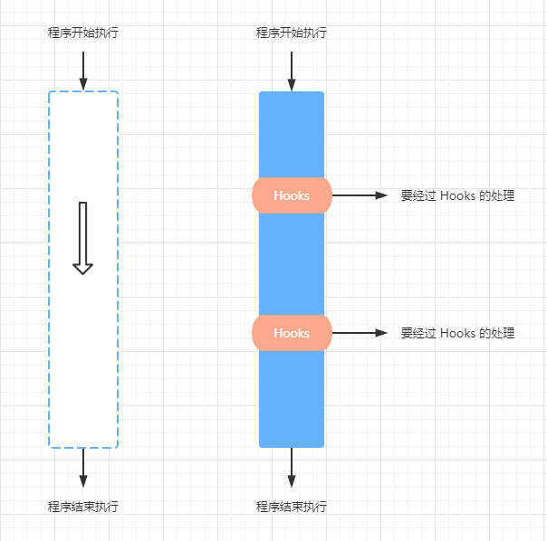

# 在 Vue3 中手写实现 React 式的 Hooks（useState、useEffect）进而深入理解函数组件 Hooks 的本质原理

### 前言

首先本文不会过度深入讲解只属于 React 或者只属于 Vue 的原理，所以只懂 React 或者只懂 Vue 的同学都可以畅通无阻地阅读本文。

关于 Vue3 的 React 式 Hooks 的实现原理和 React Hooks 的实现原理在社区里已经有很多讨论的文章了，希望本文可以给你不一样的角度去理解 React Hooks 的本质原理，也只有理解了 React Hooks 实现的本质原理，才可以在 Vue3 的函数式组件上实现跟 React Hooks 一样的 Hooks 函数，例如： useState、useReducer、useEffect 、useLayoutEffect 等。

关于 Vue3 的 React 式 Hooks，Vue.js 核心团队成员 Anthony Fu 也出了一个 Vue Hooks 工具库 VueUse，但本文不是去探讨 VueUse 的实现原理，而是通过实现一个 Vue3 函数式组件的 Hooks 去了解 React Hooks 的本质原理。本文更多的想探讨 React Hooks 的原理，同时在实现 Vue3  函数式组件的 Hooks 的过程也进一步理解 Vue3 的运行原理和调度原理等。

Vue3 的函数式组件或许很多人了解得不多，因为 Vue 官方也不推荐使用，所以通过本文你不但可以了解 React Hooks 的原理，也希望给 Vue 阵营的同学也可以提供一下关于 Vue3 函数式组件的知识。

### 在 Vue3 函数式组件中的 React-style Hooks

我们先来看一段代码

```javascript
import { useState, useReducer, useEffect, useLayoutEffect } from "vue-hooks-api";

const FunctionalComponent = (props, context) => {
  const [count1, setCount1] = useState(0);
  const [count2, setCount2] = useReducer((x) => x + 1, 1);
  const [count3, setCount3] = useReducer((x) => x + 1, 2);

  useEffect(() => {
    console.log("useEffect", count2);
  }, [count2]);

  useLayoutEffect(() => {
    console.log("useLayoutEffect", count2);
  }, [count2]);

  return (
    <>
      <button onClick={() => setCount1(2)} {...props}>
        count1:{count1}
      </button>
      <button onClick={() => setCount2()} {...props}>
        count2:{count2}
      </button>
      <button onClick={() => setCount3()} {...props}>
        count3:{count3}
      </button>
    </>
  );
};

export default FunctionalComponent;
```

React 的同学可能以为这是一个 React 的函数组件，其实不是，这是一个 Vue3 的函数式组件，通过 `vue-hooks-api` 包提供的 `useState`, `useReducer`, `useEffect`, `useLayoutEffect` Hooks 函数，就可以在 Vue3 的函数式组件中使用了，再通过 JSX 方式使用则看起来基本可以跟 React Hooks 一样了。

**关于 vue-hooks-api npm 包**

`vue-hooks-api` npm 包是本文作者发布的一个 React 风格的 Vue3 Hooks，目前只可使用于 Vue3 函数式组件，跟React 的函数式组件的 Hooks 使用方式一致。

可以通过 yarn 方式安装体验。

```
yarn add vue-hooks-api
```

注意，此 npm 包目前只是一个实验性产品，旨在探讨 React Hooks 的实现原理，慎用于生产环境。

下文也将围绕这个 `vue-hooks-api` npm 包如何实现的进行讲解。

### Hooks 是什么

首先 Hooks 不是 React 特有，比如我们使用的 Git 工具，也有 Git Hooks，在把代码 push 到远程仓库之前，可以设置 Git Hooks 插件进行代码检查、代码测试，通过了 Git Hooks 的处理之后才可以把代码 push 到远程仓库。

有 Hooks 的程序就像高速公路上的收费站，如果某个地方设置了收费站，那么你必须要经过收费站的处理，你才可以继续通行。

没有 Hooks 的程序就像国道，你可以一路畅通无阻地通行。

  

Hooks 的英文翻译是 “钩子”，Vue、React 的那些生命周期函数，也被称为钩子函数，所以 Vue、React 生命周期函数也是 Hooks 函数。

继续上面高速公路收费站的例子，那么收费站就相当于这条高速公路的一个个钩子，把这条高速公路的某个点勾住了，那么就可以在这个地点进行很多事情的处理了，比如说检查车辆，那么你可以设置只检查大货车或者小汽车，又或者节假日什么事情都不做，让所有车辆免费通行。

那么又回到 Vue、React 上面来，Vue、React 提供了很多生命周期的 Hooks，你可以在这些 Hooks 上进行各种设置，比如 Vue3 的 setup 方法就是 Vue2 的生命周期函数 beforeCreate 和 Created 两个钩子函数的代替。

了解一些前置知识之后，我们开始进入我们本文的核心 React Hooks 的理解。

### React Hooks 的本质


### Vue3 的函数组件


### Vue3 的函数组件 Hooks

